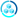

| Icon | Variable |
|-----:|:---------|
|  | \$AZURE_AI_MACHINE_LEARNING_BATCH_AI |
| -Web-Services.svg) | \$AZURE_AI_MACHINE_LEARNING_MACHINE_LEARNING_STUDIO_CLASSIC_WEB_SERVICES |
|  | \$AZURE_AI_MACHINE_LEARNING_GENOMICS |
|  | \$AZURE_AI_MACHINE_LEARNING_COMPUTER_VISION |
|  | \$AZURE_AI_MACHINE_LEARNING_CUSTOM_VISION |
|  | \$AZURE_AI_MACHINE_LEARNING_FACE_APIS |
|  | \$AZURE_AI_MACHINE_LEARNING_CONTENT_MODERATORS |
|  | \$AZURE_AI_MACHINE_LEARNING_PERSONALIZERS |
|  | \$AZURE_AI_MACHINE_LEARNING_SPEECH_SERVICES |
|  | \$AZURE_AI_MACHINE_LEARNING_QNA_MAKERS |
|  | \$AZURE_AI_MACHINE_LEARNING_TRANSLATOR_TEXT |
|  | \$AZURE_AI_MACHINE_LEARNING_LANGUAGE_UNDERSTANDING |
|  | \$AZURE_AI_MACHINE_LEARNING_IMMERSIVE_READERS |
|  | \$AZURE_AI_MACHINE_LEARNING_ANOMALY_DETECTOR |
|  | \$AZURE_AI_MACHINE_LEARNING_FORM_RECOGNIZERS |
|  | \$AZURE_AI_MACHINE_LEARNING_AZURE_EXPERIMENTATION_STUDIO |
|  | \$AZURE_AI_MACHINE_LEARNING_AZURE_OBJECT_UNDERSTANDING |
|  | \$AZURE_AI_MACHINE_LEARNING_METRICS_ADVISOR |
|  | \$AZURE_AI_MACHINE_LEARNING_AZURE_APPLIED_AI_SERVICES |
|  | \$AZURE_AI_MACHINE_LEARNING_LANGUAGE |
|  | \$AZURE_AI_MACHINE_LEARNING_BONSAI |
|  | \$AZURE_AI_MACHINE_LEARNING_COGNITIVE_SEARCH |
|  | \$AZURE_AI_MACHINE_LEARNING_COGNITIVE_SERVICES |
|  | \$AZURE_AI_MACHINE_LEARNING_GENOMICS_ACCOUNTS |
|  | \$AZURE_AI_MACHINE_LEARNING_BOT_SERVICES |
|  | \$AZURE_AI_MACHINE_LEARNING_MACHINE_LEARNING |
|  | \$AZURE_AI_MACHINE_LEARNING_MACHINE_LEARNING_STUDIO_WORKSPACES |
|  | \$AZURE_AI_MACHINE_LEARNING_MACHINE_LEARNING_STUDIO_WEB_SERVICE_PLANS |
|  | \$AZURE_ANALYTICS_LOG_ANALYTICS_WORKSPACES |
|  | \$AZURE_ANALYTICS_EVENT_HUBS |
|  | \$AZURE_ANALYTICS_STREAM_ANALYTICS_JOBS |
|  | \$AZURE_ANALYTICS_ENDPOINT_ANALYTICS |
|  | \$AZURE_ANALYTICS_AZURE_SYNAPSE_ANALYTICS |
|  | \$AZURE_ANALYTICS_AZURE_WORKBOOKS |
|  | \$AZURE_ANALYTICS_PRIVATE_LINK_SERVICES |
|  | \$AZURE_ANALYTICS_POWER_BI_EMBEDDED |
|  | \$AZURE_ANALYTICS_POWER_PLATFORM |
|  | \$AZURE_ANALYTICS_DATA_FACTORIES |
|  | \$AZURE_ANALYTICS_HD_INSIGHT_CLUSTERS |
|  | \$AZURE_ANALYTICS_DATA_LAKE_ANALYTICS |
|  | \$AZURE_ANALYTICS_AZURE_DATA_EXPLORER_CLUSTERS |
|  | \$AZURE_ANALYTICS_ANALYSIS_SERVICES |
|  | \$AZURE_ANALYTICS_EVENT_HUB_CLUSTERS |
|  | \$AZURE_ANALYTICS_DATA_LAKE_STORE_GEN1 |
|  | \$AZURE_ANALYTICS_AZURE_DATABRICKS |
|  | \$AZURE_APP_SERVICES_APP_SERVICE_PLANS |
|  | \$AZURE_APP_SERVICES_APP_SERVICE_CERTIFICATES |
|  | \$AZURE_APP_SERVICES_APP_SERVICE_DOMAINS |
|  | \$AZURE_APP_SERVICES_CDN_PROFILES |
|  | \$AZURE_APP_SERVICES_APP_SERVICES |
|  | \$AZURE_APP_SERVICES_COGNITIVE_SEARCH |
|  | \$AZURE_APP_SERVICES_NOTIFICATION_HUBS |
|  | \$AZURE_APP_SERVICES_APP_SERVICE_ENVIRONMENTS |
|  | \$AZURE_AZURE_ECOSYSTEM_COLLABORATIVE_SERVICE |
|  | \$AZURE_AZURE_ECOSYSTEM_APPLENS |
|  | \$AZURE_AZURE_ECOSYSTEM_AZURE_HYBRID_CENTER |
|  | \$AZURE_AZURE_STACK_MULTI_TENANCY |
|  | \$AZURE_AZURE_STACK_INFRASTRUCTURE_BACKUP |
|  | \$AZURE_AZURE_STACK_CAPACITY |
|  | \$AZURE_AZURE_STACK_OFFERS |
|  | \$AZURE_AZURE_STACK_USER_SUBSCRIPTIONS |
|  | \$AZURE_AZURE_STACK_PLANS |
|  | \$AZURE_AZURE_STACK_UPDATES |
|  | \$AZURE_BLOCKCHAIN_BLOCKCHAIN_APPLICATIONS |
|  | \$AZURE_BLOCKCHAIN_OUTBOUND_CONNECTION |
|  | \$AZURE_BLOCKCHAIN_AZURE_BLOCKCHAIN_SERVICE |
|  | \$AZURE_BLOCKCHAIN_AZURE_TOKEN_SERVICE |
|  | \$AZURE_BLOCKCHAIN_ABS_MEMBER |
|  | \$AZURE_BLOCKCHAIN_CONSORTIUM |
|  | \$AZURE_COMPUTE_MAINTENANCE_CONFIGURATION |
|  | \$AZURE_COMPUTE_HOST_POOLS |
|  | \$AZURE_COMPUTE_APPLICATION_GROUP |
|  | \$AZURE_COMPUTE_WORKSPACES |
|  | \$AZURE_COMPUTE_DISK_ENCRYPTION_SETS |
|  | \$AZURE_COMPUTE_WORKSPACES |
|  | \$AZURE_COMPUTE_AUTOMANAGED_VM |
|  | \$AZURE_COMPUTE_MANAGED_SERVICE_FABRIC |
|  | \$AZURE_COMPUTE_METRICS_ADVISOR |
|  | \$AZURE_COMPUTE_IMAGE_TEMPLATES |
|  | \$AZURE_COMPUTE_RESTORE_POINTS |
|  | \$AZURE_COMPUTE_RESTORE_POINTS_COLLECTIONS |
|  | \$AZURE_COMPUTE_AZURE_COMPUTE_GALLERIES |
|  | \$AZURE_COMPUTE_VIRTUAL_MACHINE |
|  | \$AZURE_COMPUTE_KUBERNETES_SERVICES |
|  | \$AZURE_COMPUTE_MESH_APPLICATIONS |
|  | \$AZURE_COMPUTE_AVAILABILITY_SETS |
|  | \$AZURE_COMPUTE_DISKS_SNAPSHOTS |
| .svg) | \$AZURE_COMPUTE_OS_IMAGES_CLASSIC |
| .svg) | \$AZURE_COMPUTE_VIRTUAL_MACHINES_CLASSIC |
|  | \$AZURE_COMPUTE_FUNCTION_APPS |
| .svg) | \$AZURE_COMPUTE_CLOUD_SERVICES_CLASSIC |
|  | \$AZURE_COMPUTE_BATCH_ACCOUNTS |
|  | \$AZURE_COMPUTE_DISKS |
|  | \$AZURE_COMPUTE_IMAGES |
|  | \$AZURE_COMPUTE_VM_SCALE_SETS |
|  | \$AZURE_COMPUTE_APP_SERVICES |
|  | \$AZURE_COMPUTE_SERVICE_FABRIC_CLUSTERS |
|  | \$AZURE_COMPUTE_IMAGE_DEFINITIONS |
|  | \$AZURE_COMPUTE_IMAGE_VERSIONS |
|  | \$AZURE_COMPUTE_SHARED_IMAGE_GALLERIES |
| .svg) | \$AZURE_COMPUTE_VM_IMAGES_CLASSIC |
| .svg) | \$AZURE_COMPUTE_DISKS_CLASSIC |
| .svg) | \$AZURE_COMPUTE_CONTAINER_SERVICES_DEPRECATED |
|  | \$AZURE_COMPUTE_CONTAINER_INSTANCES |
|  | \$AZURE_COMPUTE_HOST_GROUPS |
|  | \$AZURE_COMPUTE_HOSTS |
|  | \$AZURE_COMPUTE_AZURE_SPRING_APPS |
|  | \$AZURE_CONTAINERS_AZURE_RED_HAT_OPENSHIFT |
|  | \$AZURE_CONTAINERS_KUBERNETES_SERVICES |
|  | \$AZURE_CONTAINERS_BATCH_ACCOUNTS |
|  | \$AZURE_CONTAINERS_APP_SERVICES |
|  | \$AZURE_CONTAINERS_SERVICE_FABRIC_CLUSTERS |
|  | \$AZURE_CONTAINERS_CONTAINER_INSTANCES |
|  | \$AZURE_CONTAINERS_CONTAINER_REGISTRIES |
|  | \$AZURE_DATABASES_SQL_DATA_WAREHOUSES |
|  | \$AZURE_DATABASES_AZURE_SYNAPSE_ANALYTICS |
|  | \$AZURE_DATABASES_AZURE_SQL |
|  | \$AZURE_DATABASES_SSIS_LIFT_AND_SHIFT_IR |
|  | \$AZURE_DATABASES_AZURE_PURVIEW_ACCOUNTS |
|  | \$AZURE_DATABASES_AZURE_SQL_EDGE |
|  | \$AZURE_DATABASES_AZURE_DATABASE_POSTGRESQL_SERVER_GROUP |
|  | \$AZURE_DATABASES_AZURE_COSMOS_DB |
|  | \$AZURE_DATABASES_AZURE_DATABASE_MYSQL_SERVER |
|  | \$AZURE_DATABASES_AZURE_DATABASE_MARIADB_SERVER |
|  | \$AZURE_DATABASES_AZURE_SQL_VM |
|  | \$AZURE_DATABASES_DATA_FACTORIES |
|  | \$AZURE_DATABASES_VIRTUAL_CLUSTERS |
|  | \$AZURE_DATABASES_ELASTIC_JOB_AGENTS |
|  | \$AZURE_DATABASES_SQL_DATABASE |
|  | \$AZURE_DATABASES_AZURE_DATABASE_POSTGRESQL_SERVER |
|  | \$AZURE_DATABASES_SQL_SERVER |
|  | \$AZURE_DATABASES_AZURE_DATABASE_MIGRATION_SERVICES |
|  | \$AZURE_DATABASES_SQL_ELASTIC_POOLS |
|  | \$AZURE_DATABASES_MANAGED_DATABASE |
|  | \$AZURE_DATABASES_SQL_MANAGED_INSTANCE |
|  | \$AZURE_DATABASES_AZURE_SQL_SERVER_STRETCH_DATABASES |
|  | \$AZURE_DATABASES_CACHE_REDIS |
|  | \$AZURE_DATABASES_INSTANCE_POOLS |
|  | \$AZURE_DATABASES_AZURE_DATA_EXPLORER_CLUSTERS |
|  | \$AZURE_DATABASES_SQL_SERVER_REGISTRIES |
|  | \$AZURE_DEVOPS_APPLICATION_INSIGHTS |
|  | \$AZURE_DEVOPS_CHANGE_ANALYSIS |
|  | \$AZURE_DEVOPS_CLOUDTEST |
|  | \$AZURE_DEVOPS_LOAD_TESTING |
|  | \$AZURE_DEVOPS_LAB_ACCOUNTS |
|  | \$AZURE_DEVOPS_DEVOPS_STARTER |
|  | \$AZURE_DEVOPS_API_MANAGEMENT_SERVICES |
|  | \$AZURE_DEVOPS_API_CONNECTIONS |
|  | \$AZURE_DEVOPS_AZURE_DEVOPS |
|  | \$AZURE_DEVOPS_DEVTEST_LABS |
|  | \$AZURE_DEVOPS_LAB_SERVICES |
|  | \$AZURE_GENERAL_COST_MANAGEMENT_AND_BILLING |
|  | \$AZURE_GENERAL_PREVIEW_FEATURES |
|  | \$AZURE_GENERAL_ALL_RESOURCES |
|  | \$AZURE_GENERAL_SUBSCRIPTIONS |
|  | \$AZURE_GENERAL_RESERVATIONS |
|  | \$AZURE_GENERAL_SERVICE_HEALTH |
|  | \$AZURE_GENERAL_INFORMATION |
|  | \$AZURE_GENERAL_RECENT |
|  | \$AZURE_GENERAL_RESOURCE_GROUPS |
|  | \$AZURE_GENERAL_MARKETPLACE |
|  | \$AZURE_GENERAL_TEMPLATES |
|  | \$AZURE_GENERAL_QUICKSTART_CENTER |
|  | \$AZURE_GENERAL_MANAGEMENT_GROUPS |
|  | \$AZURE_GENERAL_HELP_AND_SUPPORT |
|  | \$AZURE_GENERAL_TAG |
|  | \$AZURE_GENERAL_DASHBOARD |
|  | \$AZURE_GENERAL_FREE_SERVICES |
|  | \$AZURE_GENERAL_COST_MANAGEMENT |
|  | \$AZURE_GENERAL_MARKETPLACE_MANAGEMENT |
|  | \$AZURE_GENERAL_REGION_MANAGEMENT |
|  | \$AZURE_GENERAL_TROUBLESHOOT |
|  | \$AZURE_GENERAL_RESOURCE_EXPLORER |
|  | \$AZURE_GENERAL_BIZ_TALK |
|  | \$AZURE_GENERAL_BLOB_BLOCK |
|  | \$AZURE_GENERAL_BLOB_PAGE |
|  | \$AZURE_GENERAL_BRANCH |
|  | \$AZURE_GENERAL_BROWSER |
|  | \$AZURE_GENERAL_BUG |
|  | \$AZURE_GENERAL_BUILDS |
|  | \$AZURE_GENERAL_CACHE |
|  | \$AZURE_GENERAL_CODE |
|  | \$AZURE_GENERAL_COMMIT |
|  | \$AZURE_GENERAL_CONTROLS |
|  | \$AZURE_GENERAL_CONTROLS_HORIZONTAL |
|  | \$AZURE_GENERAL_COST_ALERTS |
|  | \$AZURE_GENERAL_COST_ANALYSIS |
|  | \$AZURE_GENERAL_COST_BUDGETS |
|  | \$AZURE_GENERAL_COUNTER |
|  | \$AZURE_GENERAL_CUBES |
|  | \$AZURE_GENERAL_DEV_CONSOLE |
|  | \$AZURE_GENERAL_DOWNLOAD |
|  | \$AZURE_GENERAL_ERROR |
|  | \$AZURE_GENERAL_EXTENSIONS |
|  | \$AZURE_GENERAL_FILE |
|  | \$AZURE_GENERAL_FILES |
|  | \$AZURE_GENERAL_FOLDER_BLANK |
|  | \$AZURE_GENERAL_FOLDER_WEBSITE |
|  | \$AZURE_GENERAL_FTP |
|  | \$AZURE_GENERAL_GEAR |
|  | \$AZURE_GENERAL_GLOBE_ERROR |
|  | \$AZURE_GENERAL_GLOBE_SUCCESS |
|  | \$AZURE_GENERAL_GLOBE_WARNING |
|  | \$AZURE_GENERAL_GUIDE |
|  | \$AZURE_GENERAL_HEART |
|  | \$AZURE_GENERAL_IMAGE |
|  | \$AZURE_GENERAL_INPUT_OUTPUT |
|  | \$AZURE_GENERAL_JOURNEY_HUB |
|  | \$AZURE_GENERAL_LAUNCH_PORTAL |
|  | \$AZURE_GENERAL_LEARN |
|  | \$AZURE_GENERAL_LOAD_TEST |
|  | \$AZURE_GENERAL_LOCATION |
|  | \$AZURE_GENERAL_LOG_STREAMING |
|  | \$AZURE_GENERAL_MANAGEMENT_PORTAL |
|  | \$AZURE_GENERAL_MEDIA_FILE |
|  | \$AZURE_GENERAL_MOBILE |
|  | \$AZURE_GENERAL_MOBILE_ENGAGEMENT |
|  | \$AZURE_GENERAL_POWER |
|  | \$AZURE_GENERAL_POWERSHELL |
|  | \$AZURE_GENERAL_POWER_UP |
|  | \$AZURE_GENERAL_FEATURE_PREVIEWS |
|  | \$AZURE_GENERAL_PROCESS_EXPLORER |
|  | \$AZURE_GENERAL_PRODUCTION_READY_DATABASE |
|  | \$AZURE_GENERAL_RESOURCE_GROUP_LIST |
|  | \$AZURE_GENERAL_RESOURCE_LINKED |
|  | \$AZURE_GENERAL_SCHEDULER |
|  | \$AZURE_GENERAL_SEARCH |
|  | \$AZURE_GENERAL_SERVER_FARM |
|  | \$AZURE_GENERAL_SSD |
|  | \$AZURE_GENERAL_STORAGE_AZURE_FILES |
|  | \$AZURE_GENERAL_STORAGE_CONTAINER |
|  | \$AZURE_GENERAL_STORAGE_QUEUE |
|  | \$AZURE_GENERAL_TABLE |
|  | \$AZURE_GENERAL_TAGS |
|  | \$AZURE_GENERAL_TFS_VC_REPOSITORY |
|  | \$AZURE_GENERAL_TOOLBOX |
|  | \$AZURE_GENERAL_VERSIONS |
|  | \$AZURE_GENERAL_WEBSITE_POWER |
|  | \$AZURE_GENERAL_WEBSITE_STAGING |
|  | \$AZURE_GENERAL_WEB_SLOTS |
|  | \$AZURE_GENERAL_WEB_TEST |
|  | \$AZURE_GENERAL_WORKBOOKS |
|  | \$AZURE_GENERAL_WORKFLOW |
|  | \$AZURE_GENERAL_BACKLOG |
|  | \$AZURE_GENERAL_MEDIA |
|  | \$AZURE_GENERAL_MODULE |
|  | \$AZURE_GENERAL_SEARCH_GRID |
|  | \$AZURE_IDENTITY_SECURITY |
|  | \$AZURE_IDENTITY_ADMINISTRATIVE_UNITS |
|  | \$AZURE_IDENTITY_VERIFIABLE_CREDENTIALS |
|  | \$AZURE_IDENTITY_AZURE_AD_PRIVLEGED_IDENTITY_MANAGEMENT |
|  | \$AZURE_IDENTITY_API_PROXY |
|  | \$AZURE_IDENTITY_TENANT_PROPERTIES |
|  | \$AZURE_IDENTITY_CUSTOM_AZURE_AD_ROLES |
|  | \$AZURE_IDENTITY_AAD_LICENSES |
|  | \$AZURE_IDENTITY_EXTERNAL_IDENTITIES |
|  | \$AZURE_IDENTITY_AZURE_ACTIVE_DIRECTORY |
|  | \$AZURE_IDENTITY_AZURE_AD_DOMAIN_SERVICES |
|  | \$AZURE_IDENTITY_GROUPS |
|  | \$AZURE_IDENTITY_ACTIVE_DIRECTORY_CONNECT_HEALTH |
|  | \$AZURE_IDENTITY_ENTERPRISE_APPLICATIONS |
|  | \$AZURE_IDENTITY_MANAGED_IDENTITIES |
|  | \$AZURE_IDENTITY_AZURE_AD_B2C |
|  | \$AZURE_IDENTITY_AZURE_INFORMATION_PROTECTION |
|  | \$AZURE_IDENTITY_USERS |
|  | \$AZURE_IDENTITY_AZURE_AD_IDENTITY_PROTECTION |
|  | \$AZURE_IDENTITY_APP_REGISTRATIONS |
|  | \$AZURE_IDENTITY_AZURE_AD_PRIVILEGE_IDENTITY_MANAGEMENT |
|  | \$AZURE_IDENTITY_IDENTITY_GOVERNANCE |
|  | \$AZURE_IDENTITY_AZURE_AD_ROLES_AND_ADMINISTRATORS |
|  | \$AZURE_IDENTITY_USER_SETTINGS |
|  | \$AZURE_INTEGRATION_SQL_DATA_WAREHOUSES |
|  | \$AZURE_INTEGRATION_INTEGRATION_SERVICE_ENVIRONMENTS |
|  | \$AZURE_INTEGRATION_AZURE_DATABOX_GATEWAY |
|  | \$AZURE_INTEGRATION_PARTNER_TOPIC |
|  | \$AZURE_INTEGRATION_SYSTEM_TOPIC |
|  | \$AZURE_INTEGRATION_PARTNER_REGISTRATION |
|  | \$AZURE_INTEGRATION_PARTNER_NAMESPACE |
|  | \$AZURE_INTEGRATION_LOGIC_APPS |
|  | \$AZURE_INTEGRATION_POWER_PLATFORM |
|  | \$AZURE_INTEGRATION_API_MANAGEMENT_SERVICES |
|  | \$AZURE_INTEGRATION_API_CONNECTIONS |
|  | \$AZURE_INTEGRATION_STORSIMPLE_DEVICE_MANAGERS |
|  | \$AZURE_INTEGRATION_AZURE_STACK_EDGE |
|  | \$AZURE_INTEGRATION_DATA_FACTORIES |
|  | \$AZURE_INTEGRATION_AZURE_SQL_SERVER_STRETCH_DATABASES |
|  | \$AZURE_INTEGRATION_EVENT_GRID_TOPICS |
|  | \$AZURE_INTEGRATION_RELAYS |
|  | \$AZURE_INTEGRATION_AZURE_API_FOR_FHIR |
|  | \$AZURE_INTEGRATION_SOFTWARE_AS_A_SERVICE |
|  | \$AZURE_INTEGRATION_EVENT_GRID_DOMAINS |
|  | \$AZURE_INTEGRATION_AZURE_DATA_CATALOG |
|  | \$AZURE_INTEGRATION_INTEGRATION_ACCOUNTS |
|  | \$AZURE_INTEGRATION_APP_CONFIGURATION |
|  | \$AZURE_INTEGRATION_SENDGRID_ACCOUNTS |
|  | \$AZURE_INTEGRATION_EVENT_GRID_SUBSCRIPTIONS |
|  | \$AZURE_INTEGRATION_LOGIC_APPS_CUSTOM_CONNECTOR |
|  | \$AZURE_INTEGRATION_AZURE_SERVICE_BUS |
|  | \$AZURE_INTUNE_DEVICE_SECURITY_APPLE |
|  | \$AZURE_INTUNE_DEVICE_SECURITY_GOOGLE |
|  | \$AZURE_INTUNE_DEVICE_SECURITY_WINDOWS |
|  | \$AZURE_INTUNE_INTUNE |
|  | \$AZURE_INTUNE_EBOOKS |
|  | \$AZURE_INTUNE_CLIENT_APPS |
|  | \$AZURE_INTUNE_DEVICES |
|  | \$AZURE_INTUNE_DEVICE_COMPLIANCE |
|  | \$AZURE_INTUNE_SOFTWARE_UPDATES |
|  | \$AZURE_INTUNE_SECURITY_BASELINES |
|  | \$AZURE_INTUNE_DEVICE_ENROLLMENT |
|  | \$AZURE_INTUNE_DEVICE_CONFIGURATION |
|  | \$AZURE_INTUNE_EXCHANGE_ACCESS |
|  | \$AZURE_INTUNE_AZURE_AD_ROLES_AND_ADMINISTRATORS |
|  | \$AZURE_INTUNE_TENANT_STATUS |
|  | \$AZURE_INTUNE_INTUNE_FOR_EDUCATION |
|  | \$AZURE_INTUNE_INTUNE_APP_PROTECTION |
|  | \$AZURE_INTUNE_MINDARO |
| -Web-Services.svg) | \$AZURE_IOT_MACHINE_LEARNING_STUDIO_CLASSIC_WEB_SERVICES |
|  | \$AZURE_IOT_EVENT_HUBS |
|  | \$AZURE_IOT_STREAM_ANALYTICS_JOBS |
|  | \$AZURE_IOT_AZURE_DATABOX_GATEWAY |
|  | \$AZURE_IOT_DIGITAL_TWINS |
|  | \$AZURE_IOT_INDUSTRIAL_IOT |
|  | \$AZURE_IOT_LOGIC_APPS |
|  | \$AZURE_IOT_FUNCTION_APPS |
|  | \$AZURE_IOT_NOTIFICATION_HUBS |
|  | \$AZURE_IOT_NOTIFICATION_HUB_NAMESPACES |
|  | \$AZURE_IOT_AZURE_STACK |
|  | \$AZURE_IOT_AZURE_COSMOS_DB |
|  | \$AZURE_IOT_EVENT_HUB_CLUSTERS |
|  | \$AZURE_IOT_MACHINE_LEARNING_STUDIO_WORKSPACES |
|  | \$AZURE_IOT_MACHINE_LEARNING_STUDIO_WEB_SERVICE_PLANS |
|  | \$AZURE_IOT_TIME_SERIES_INSIGHTS_ENVIRONMENTS |
|  | \$AZURE_IOT_IOT_HUB |
|  | \$AZURE_IOT_IOT_CENTRAL_APPLICATIONS |
|  | \$AZURE_IOT_AZURE_MAPS_ACCOUNTS |
|  | \$AZURE_IOT_IOT_EDGE |
|  | \$AZURE_IOT_TIME_SERIES_INSIGHTS_EVENT_SOURCES |
|  | \$AZURE_IOT_TIME_SERIES_INSIGHTS_ACCESS_POLICIES |
|  | \$AZURE_IOT_TIME_SERIES_DATA_SETS |
|  | \$AZURE_IOT_WINDOWS10_CORE_SERVICES |
|  | \$AZURE_IOT_EVENT_GRID_SUBSCRIPTIONS |
|  | \$AZURE_IOT_DEVICE_PROVISIONING_SERVICES |
|  | \$AZURE_MANAGEMENT_GOVERNANCE_MONITOR |
|  | \$AZURE_MANAGEMENT_GOVERNANCE_ALERTS |
|  | \$AZURE_MANAGEMENT_GOVERNANCE_ADVISOR |
|  | \$AZURE_MANAGEMENT_GOVERNANCE_COST_MANAGEMENT_AND_BILLING |
|  | \$AZURE_MANAGEMENT_GOVERNANCE_BLUEPRINTS |
|  | \$AZURE_MANAGEMENT_GOVERNANCE_ACTIVITY_LOG |
|  | \$AZURE_MANAGEMENT_GOVERNANCE_DIAGNOSTICS_SETTINGS |
|  | \$AZURE_MANAGEMENT_GOVERNANCE_LOG_ANALYTICS_WORKSPACES |
|  | \$AZURE_MANAGEMENT_GOVERNANCE_SCHEDULER_JOB_COLLECTIONS |
|  | \$AZURE_MANAGEMENT_GOVERNANCE_COMPLIANCE |
|  | \$AZURE_MANAGEMENT_GOVERNANCE_APPLICATION_INSIGHTS |
|  | \$AZURE_MANAGEMENT_GOVERNANCE_MY_CUSTOMERS |
|  | \$AZURE_MANAGEMENT_GOVERNANCE_RECOVERY_SERVICES_VAULTS |
|  | \$AZURE_MANAGEMENT_GOVERNANCE_METRICS |
|  | \$AZURE_MANAGEMENT_GOVERNANCE_SOLUTIONS |
|  | \$AZURE_MANAGEMENT_GOVERNANCE_AUTOMATION_ACCOUNTS |
| .svg) | \$AZURE_MANAGEMENT_GOVERNANCE_OPERATION_LOG_CLASSIC |
|  | \$AZURE_MANAGEMENT_GOVERNANCE_SERVICE_PROVIDERS |
|  | \$AZURE_MANAGEMENT_GOVERNANCE_EDUCATION |
|  | \$AZURE_MANAGEMENT_GOVERNANCE_SERVICE_CATALOG_MAD |
|  | \$AZURE_MANAGEMENT_GOVERNANCE_INTUNE_TRENDS |
|  | \$AZURE_MANAGEMENT_GOVERNANCE_AZURE_LIGHTHOUSE |
|  | \$AZURE_MANAGEMENT_GOVERNANCE_UNIVERSAL_PRINT |
|  | \$AZURE_MANAGEMENT_GOVERNANCE_AZURE_ARC |
|  | \$AZURE_MANAGEMENT_GOVERNANCE_ARC_MACHINES |
|  | \$AZURE_MANAGEMENT_GOVERNANCE_USER_PRIVACY |
|  | \$AZURE_MANAGEMENT_GOVERNANCE_MANAGED_DESKTOP |
|  | \$AZURE_MANAGEMENT_GOVERNANCE_MANAGED_APPLICATIONS_CENTER |
|  | \$AZURE_MANAGEMENT_GOVERNANCE_CUSTOMER_LOCKBOX_FOR_MICROSOFT_AZURE |
|  | \$AZURE_MANAGEMENT_GOVERNANCE_POLICY |
|  | \$AZURE_MANAGEMENT_GOVERNANCE_RESOURCE_GRAPH_EXPLORER |
|  | \$AZURE_MANAGEMENT_GOVERNANCE_MACHINESAZUREARC |
|  | \$AZURE_MENU_KEYS |
|  | \$AZURE_MIGRATE_COST_MANAGEMENT_AND_BILLING |
|  | \$AZURE_MIGRATE_RECOVERY_SERVICES_VAULTS |
|  | \$AZURE_MIGRATE_AZURE_DATABOX_GATEWAY |
|  | \$AZURE_MIGRATE_DATA_BOX |
|  | \$AZURE_MIGRATE_AZURE_STACK_EDGE |
|  | \$AZURE_MIGRATE_AZURE_MIGRATE |
|  | \$AZURE_MIGRATION_AZURE_DATABASE_MIGRATION_SERVICES |
|  | \$AZURE_MIXED_REALITY_REMOTE_RENDERING |
|  | \$AZURE_MIXED_REALITY_SPATIAL_ANCHOR_ACCOUNTS |
|  | \$AZURE_MOBILE_POWER_PLATFORM |
|  | \$AZURE_MOBILE_APP_SERVICES |
|  | \$AZURE_MOBILE_NOTIFICATION_HUBS |
|  | \$AZURE_MONITOR_MONITOR |
|  | \$AZURE_MONITOR_ACTIVITY_LOG |
|  | \$AZURE_MONITOR_DIAGNOSTICS_SETTINGS |
|  | \$AZURE_MONITOR_LOG_ANALYTICS_WORKSPACES |
|  | \$AZURE_MONITOR_APPLICATION_INSIGHTS |
|  | \$AZURE_MONITOR_METRICS |
|  | \$AZURE_MONITOR_AZURE_MONITORS_FOR_SAP_SOLUTIONS |
|  | \$AZURE_MONITOR_CHANGE_ANALYSIS |
|  | \$AZURE_MONITOR_AZURE_WORKBOOKS |
|  | \$AZURE_MONITOR_NETWORK_WATCHER |
|  | \$AZURE_MONITOR_AUTO_SCALE |
|  | \$AZURE_NETWORKING_CDN_PROFILES |
|  | \$AZURE_NETWORKING_AZURE_FIREWALL_MANAGER |
|  | \$AZURE_NETWORKING_AZURE_FIREWALL_POLICY |
|  | \$AZURE_NETWORKING_PRIVATE_LINK |
|  | \$AZURE_NETWORKING_IP_GROUPS |
|  | \$AZURE_NETWORKING_VIRTUAL_WAN_HUB |
|  | \$AZURE_NETWORKING_PRIVATE_LINK_SERVICE |
|  | \$AZURE_NETWORKING_RESOURCE_MANAGEMENT_PRIVATE_LINK |
|  | \$AZURE_NETWORKING_PRIVATE_LINK_SERVICES |
|  | \$AZURE_NETWORKING_LOAD_BALANCER_HUB |
|  | \$AZURE_NETWORKING_BASTIONS |
|  | \$AZURE_NETWORKING_VIRTUAL_ROUTER |
|  | \$AZURE_NETWORKING_CONNECTED_CACHE |
|  | \$AZURE_NETWORKING_SPOT_VMSS |
|  | \$AZURE_NETWORKING_SPOT_VM |
|  | \$AZURE_NETWORKING_SUBNET |
|  | \$AZURE_NETWORKING_DNS_PRIVATE_RESOLVER |
|  | \$AZURE_NETWORKING_VIRTUAL_NETWORKS |
|  | \$AZURE_NETWORKING_LOAD_BALANCERS |
|  | \$AZURE_NETWORKING_VIRTUAL_NETWORK_GATEWAYS |
|  | \$AZURE_NETWORKING_DNS_ZONES |
|  | \$AZURE_NETWORKING_TRAFFIC_MANAGER_PROFILES |
|  | \$AZURE_NETWORKING_NETWORK_WATCHER |
|  | \$AZURE_NETWORKING_NETWORK_SECURITY_GROUPS |
| .svg) | \$AZURE_NETWORKING_PUBLIC_IP_ADDRESSES_CLASSIC |
|  | \$AZURE_NETWORKING_PUBLIC_IP_ADDRESSES |
|  | \$AZURE_NETWORKING_ON_PREMISES_DATA_GATEWAYS |
|  | \$AZURE_NETWORKING_ROUTE_FILTERS |
|  | \$AZURE_NETWORKING_DDOS_PROTECTION_PLANS |
|  | \$AZURE_NETWORKING_FRONT_DOOR_AND_CDN_PROFILES |
| .svg) | \$AZURE_NETWORKING_VIRTUAL_NETWORKS_CLASSIC |
|  | \$AZURE_NETWORKING_APPLICATION_GATEWAYS |
|  | \$AZURE_NETWORKING_LOCAL_NETWORK_GATEWAYS |
|  | \$AZURE_NETWORKING_EXPRESSROUTE_CIRCUITS |
|  | \$AZURE_NETWORKING_NETWORK_INTERFACES |
|  | \$AZURE_NETWORKING_CONNECTIONS |
|  | \$AZURE_NETWORKING_ROUTE_TABLES |
|  | \$AZURE_NETWORKING_FIREWALLS |
|  | \$AZURE_NETWORKING_SERVICE_ENDPOINT_POLICIES |
|  | \$AZURE_NETWORKING_NAT |
|  | \$AZURE_NETWORKING_VIRTUAL_WANS |
| .svg) | \$AZURE_NETWORKING_WEB_APPLICATION_FIREWALL_POLICIESWAF |
|  | \$AZURE_NETWORKING_PROXIMITY_PLACEMENT_GROUPS |
| .svg) | \$AZURE_NETWORKING_RESERVED_IP_ADDRESSES_CLASSIC |
|  | \$AZURE_NETWORKING_PUBLIC_IP_PREFIXES |
|  | \$AZURE_NEW_ICONS_CONNECTED_VEHICLE_PLATFORM |
|  | \$AZURE_NEW_ICONS_ENTRA_IDENTITY |
|  | \$AZURE_OTHER_AZURE_VIRTUAL_DESKTOP |
|  | \$AZURE_OTHER_SSH_KEYS |
|  | \$AZURE_OTHER_INTERNET_ANALYZER_PROFILES |
|  | \$AZURE_OTHER_AZURE_CLOUD_SHELL |
|  | \$AZURE_OTHER_VIDEO_ANALYZERS |
|  | \$AZURE_OTHER_EXPRESSROUTE_DIRECT |
|  | \$AZURE_OTHER_COST_EXPORT |
|  | \$AZURE_OTHER_AZURE_COMMUNICATION_SERVICES |
|  | \$AZURE_OTHER_PEERING_SERVICE |
|  | \$AZURE_OTHER_AZURE_NETWORK_FUNCTION_MANAGER_FUNCTIONS |
|  | \$AZURE_OTHER_LOG_ANALYTICS_QUERY_PACK |
|  | \$AZURE_OTHER_ARC_KUBERNETES |
|  | \$AZURE_OTHER_AZURE_VMWARE_SOLUTION |
|  | \$AZURE_OTHER_PEERINGS |
|  | \$AZURE_OTHER_DASHBOARD_HUB |
|  | \$AZURE_OTHER_AZURE_VIDEO_INDEXER |
|  | \$AZURE_OTHER_AVS_VM |
|  | \$AZURE_OTHER_ARC_POSTGRESQL_ |
|  | \$AZURE_OTHER_ARC_SQL_MANAGED_INSTANCE |
|  | \$AZURE_OTHER_ARC_SQL_SERVER |
|  | \$AZURE_OTHER_DATA_COLLECTION_RULES |
|  | \$AZURE_OTHER_RESOURCE_MOVER |
|  | \$AZURE_OTHER_AZURE_CHAOS_STUDIO |
|  | \$AZURE_OTHER_NETWORK_MANAGERS |
|  | \$AZURE_OTHER_DEDICATED_HSM |
|  | \$AZURE_OTHER_MODULAR_DATA_CENTER |
|  | \$AZURE_OTHER_TEMPLATE_SPECS |
|  | \$AZURE_OTHER_ARC_DATA_SERVICES |
|  | \$AZURE_OTHER_AZURE_BACKUP_CENTER |
|  | \$AZURE_OTHER_BACKUP_VAULT |
|  | \$AZURE_OTHER_DEVICE_UPDATE_IOT_HUB |
|  | \$AZURE_OTHER_FIJI |
|  | \$AZURE_OTHER_AZURE_MONITOR_DASHBOARD |
|  | \$AZURE_OTHER_SCVMM_MANAGEMENT_SERVERS |
| .svg) | \$AZURE_OTHER_CLOUD_SERVICES_EXTENDED_SUPPORT |
|  | \$AZURE_OTHER_AZURE_SUPPORT_CENTER_BLUE |
|  | \$AZURE_OTHER_WEB_APP_DATABASE |
|  | \$AZURE_OTHER_AZURE_HPC_WORKBENCHES |
|  | \$AZURE_OTHER_DISK_POOL |
|  | \$AZURE_OTHER_BARE_METAL_INFRASTRUCTURE |
|  | \$AZURE_OTHER_PRIVATE_ENDPOINTS |
|  | \$AZURE_OTHER_OPEN_SUPPLY_CHAIN_PLATFORM |
|  | \$AZURE_OTHER_AQUILA |
|  | \$AZURE_OTHER_RESERVED_CAPACITY |
|  | \$AZURE_OTHER_CUSTOM_IP_PREFIX |
|  | \$AZURE_OTHER_FHIR_SERVICE |
|  | \$AZURE_OTHER_MEDTECH_SERVICE |
|  | \$AZURE_OTHER_MANAGED_INSTANCE_APACHE_CASSANDRA |
|  | \$AZURE_OTHER_CONFIDENTIAL_LEDGERS |
|  | \$AZURE_OTHER_AAD_LICENSES |
|  | \$AZURE_OTHER_TEST_BASE |
|  | \$AZURE_OTHER_AZURE_ORBITAL |
|  | \$AZURE_OTHER_CAPACITY_RESERVATION_GROUPS |
|  | \$AZURE_OTHER_WINDOWS_NOTIFICATION_SERVICES |
|  | \$AZURE_OTHER_AZURE_NETWORK_FUNCTION_MANAGER |
|  | \$AZURE_OTHER_MISSION_LANDING_ZONE |
|  | \$AZURE_OTHER_MOBILE_NETWORKS |
|  | \$AZURE_OTHER_VM_APP_DEFINITIONS |
|  | \$AZURE_OTHER_VM_APP_VERSIONS |
|  | \$AZURE_OTHER_AZURE_EDGE_HARDWARE_CENTER |
|  | \$AZURE_OTHER_RESOURCE_GUARD |
|  | \$AZURE_OTHER_CERES |
|  | \$AZURE_OTHER_AZURITE |
|  | \$AZURE_OTHER_UPDATE_MANAGEMENT_CENTER |
|  | \$AZURE_OTHER_AZURE_COMPUTE_GALLERIES |
|  | \$AZURE_OTHER_COMMUNITY_IMAGES |
|  | \$AZURE_OTHER_VM_IMAGE_VERSION |
|  | \$AZURE_OTHER_SAVINGS_PLANS |
|  | \$AZURE_OTHER_WORKER_CONTAINER_APP |
|  | \$AZURE_OTHER_AZURE_MANAGED_GRAFANA |
|  | \$AZURE_OTHER_TARGETS_MANAGEMENT |
|  | \$AZURE_OTHER_STORAGE_TASKS |
|  | \$AZURE_OTHER_SONIC_DASH |
|  | \$AZURE_OTHER_COMPLIANCE_CENTER |
|  | \$AZURE_OTHER_NETWORK_SECURITY_PERIMETERS |
|  | \$AZURE_OTHER_AZURE_LOAD_TESTING |
|  | \$AZURE_OTHER_VIRTUAL_VISITS_BUILDER |
|  | \$AZURE_OTHER_AZURE_QUOTAS |
|  | \$AZURE_OTHER_CONTAINER_APPS_ENVIRONMENTS |
|  | \$AZURE_OTHER_APP_COMPLIANCE_AUTOMATION |
|  | \$AZURE_OTHER_VIRTUAL_INSTANCE_FOR_SAP |
|  | \$AZURE_OTHER_AZURE_CENTER_FOR_SAP |
|  | \$AZURE_OTHER_AZURE_STORAGE_MOVER |
|  | \$AZURE_OTHER_CENTRAL_SERVICE_INSTANCE_FOR_SAP |
|  | \$AZURE_OTHER_KUBERNETES_FLEET_MANAGER |
|  | \$AZURE_OTHER_EXPRESS_ROUTE_TRAFFIC_COLLECTOR |
|  | \$AZURE_OTHER_DATABASE_INSTANCE_FOR_SAP |
|  | \$AZURE_OTHER_ELASTIC_SAN |
|  | \$AZURE_OTHER_MICROSOFT_DEV_BOX |
|  | \$AZURE_OTHER_AZURE_DEPLOYMENT_ENVIRONMENTS |
|  | \$AZURE_OTHER_DEFENDER_CM_LOCAL_MANAGER |
|  | \$AZURE_OTHER_DEFENDER_EXTERNAL_MANAGEMENT |
|  | \$AZURE_OTHER_DEFENDER_FREEZER_MONITOR |
|  | \$AZURE_OTHER_DEFENDER_HISTORIAN |
|  | \$AZURE_OTHER_DEFENDER_HMI |
|  | \$AZURE_OTHER_DEFENDER_MARQUEE |
|  | \$AZURE_OTHER_DEFENDER_ROBOT_CONTROLLER |
|  | \$AZURE_OTHER_DEFENDER_SENSOR |
|  | \$AZURE_OTHER_DEFENDER_SLOT |
|  | \$AZURE_OTHER_DEFENDER_WEB_GUIDING_SYSTEM |
|  | \$AZURE_OTHER_DEFENDER_DCS_CONTROLLER |
|  | \$AZURE_OTHER_DEFENDER_DISTRIBUTER_CONTROL_SYSTEM |
|  | \$AZURE_OTHER_DEFENDER_ENGINEERING_STATION |
|  | \$AZURE_OTHER_DEFENDER_INDUSTRIAL_PACKAGING_SYSTEM |
|  | \$AZURE_OTHER_DEFENDER_INDUSTRIAL_PRINTER |
|  | \$AZURE_OTHER_DEFENDER_INDUSTRIAL_SCALE_SYSTEM |
|  | \$AZURE_OTHER_DEFENDER_INDUSTRIAL_ROBOT |
|  | \$AZURE_OTHER_DEFENDER_METER |
|  | \$AZURE_OTHER_DEFENDER_PLC |
|  | \$AZURE_OTHER_DEFENDER_PNEUMATIC_DEVICE |
|  | \$AZURE_OTHER_DEFENDER_PROGRAMABLE_BOARD |
|  | \$AZURE_OTHER_DEFENDER_RELAY |
|  | \$AZURE_OTHER_DEFENDER_RTU |
|  | \$AZURE_OTHER_AZURE_A |
|  | \$AZURE_OTHER_LOCAL_NETWORK_GATEWAYS |
|  | \$AZURE_OTHER_EDGE_MANAGEMENT |
|  | \$AZURE_OTHER_INSTANCE_POOLS |
|  | \$AZURE_OTHER_AZURE_SPHERE |
|  | \$AZURE_OTHER_APP_REGISTRATIONS |
|  | \$AZURE_OTHER_EXCHANGE_ON_PREMISES_ACCESS |
|  | \$AZURE_OTHER_WAC |
|  | \$AZURE_OTHER_AZUREATTESTATION |
|  | \$AZURE_OTHER_RTOS |
|  | \$AZURE_OTHER_WEB_JOBS |
|  | \$AZURE_SECURITY_DETONATION |
|  | \$AZURE_SECURITY_MICROSOFT_DEFENDER_FOR_IOT |
|  | \$AZURE_SECURITY_AZURE_AD_PRIVLEGED_IDENTITY_MANAGEMENT |
|  | \$AZURE_SECURITY_MICROSOFT_DEFENDER_EASM |
|  | \$AZURE_SECURITY_IDENTITY_SECURE_SCORE |
|  | \$AZURE_SECURITY_AZURE_AD_RISKY_SIGNINS |
|  | \$AZURE_SECURITY_AZURE_AD_RISKY_USERS |
|  | \$AZURE_SECURITY_AZURE_AD_AUTHENTICATION_METHODS |
|  | \$AZURE_SECURITY_MULTIFACTOR_AUTHENTICATION |
|  | \$AZURE_SECURITY_AZURE_INFORMATION_PROTECTION |
|  | \$AZURE_SECURITY_AZURE_AD_IDENTITY_PROTECTION |
|  | \$AZURE_SECURITY_CONDITIONAL_ACCESS |
|  | \$AZURE_SECURITY_MICROSOFT_DEFENDER_FOR_CLOUD |
|  | \$AZURE_SECURITY_APPLICATION_SECURITY_GROUPS |
|  | \$AZURE_SECURITY_KEY_VAULTS |
|  | \$AZURE_SECURITY_AZURE_SENTINEL |
|  | \$AZURE_SECURITY_USER_SETTINGS |
|  | \$AZURE_SECURITY_EXTENDEDSECURITYUPDATES |
|  | \$AZURE_STORAGE_RECOVERY_SERVICES_VAULTS |
|  | \$AZURE_STORAGE_AZURE_DATABOX_GATEWAY |
|  | \$AZURE_STORAGE_AZURE_HCP_CACHE |
|  | \$AZURE_STORAGE_STORAGE_ACCOUNTS |
| .svg) | \$AZURE_STORAGE_STORAGE_ACCOUNTS_CLASSIC |
|  | \$AZURE_STORAGE_STORSIMPLE_DEVICE_MANAGERS |
|  | \$AZURE_STORAGE_DATA_LAKE_STORAGE_GEN1 |
|  | \$AZURE_STORAGE_STORAGE_EXPLORER |
|  | \$AZURE_STORAGE_STORSIMPLE_DATA_MANAGERS |
|  | \$AZURE_STORAGE_STORAGE_SYNC_SERVICES |
|  | \$AZURE_STORAGE_DATA_BOX |
|  | \$AZURE_STORAGE_AZURE_STACK_EDGE |
|  | \$AZURE_STORAGE_AZURE_NETAPP_FILES |
|  | \$AZURE_STORAGE_DATA_SHARE_INVITATIONS |
|  | \$AZURE_STORAGE_DATA_SHARES |
|  | \$AZURE_STORAGE_IMPORT_EXPORT_JOBS |
|  | \$AZURE_STORAGE_AZURE_FILESHARES |
|  | \$AZURE_WEB_APP_SERVICE_PLANS |
|  | \$AZURE_WEB_APP_SERVICE_CERTIFICATES |
|  | \$AZURE_WEB_APP_SERVICE_DOMAINS |
|  | \$AZURE_WEB_STATIC_APPS |
|  | \$AZURE_WEB_POWER_PLATFORM |
|  | \$AZURE_WEB_APP_SERVICES |
|  | \$AZURE_WEB_API_MANAGEMENT_SERVICES |
|  | \$AZURE_WEB_COGNITIVE_SEARCH |
|  | \$AZURE_WEB_APP_SERVICE_ENVIRONMENTS |
|  | \$AZURE_WEB_API_CONNECTIONS |
|  | \$AZURE_WEB_SIGNALR |
|  | \$AZURE_WEB_NOTIFICATION_HUB_NAMESPACES |
|  | \$AZURE_WEB_FRONT_DOOR_AND_CDN_PROFILES |
|  | \$AZURE_WEB_COGNITIVE_SERVICES |
|  | \$AZURE_WEB_AZURE_MEDIA_SERVICE |
|  | \$AZURE_WEB_AZURE_SPRING_APPS |
